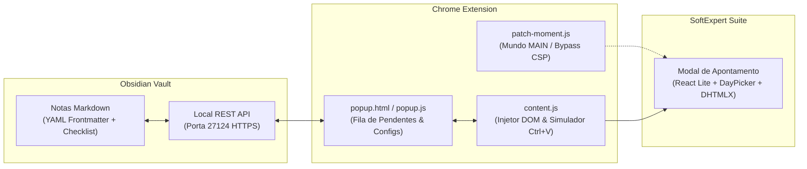

# Documentação Completa: Automação SoftExpert & Obsidian (N1 Sankhya)

> **Data de Compilação:** 28 de Setembro de 2026  
> **Repositório GitHub:** [github.com/kaio-keinner/Automa-o-SoftExpert](https://github.com/kaio-keinner/Automa-o-SoftExpert)  
> **Tecnologias:** Google Chrome Extension (Manifest V3), Obsidian Local REST API, React DOM, Moment.js, DHTMLX, JavaScript (ES6+), Markdown YAML Frontmatter.

---

## 📑 Índice
1. [Visão Geral e Objetivos do Projeto](#1-visão-geral-e-objetivos-do-projeto)
2. [Fluxo e Integração Bidirecional](#2-fluxo-e-integração-bidirecional)
3. [Cronograma e Enriquecimento das Notas (Setembro/2026)](#3-cronograma-e-enriquecimento-das-notas-setembro2026)
4. [Arquitetura dos Componentes](#4-arquitetura-dos-componentes)
5. [Histórico de Desafios, Diagnósticos e Soluções](#5-histórico-de-desafios-diagnósticos-e-soluções)
   - 5.1 [Fila zerada e normalização Windows CRLF](#51-fila-zerada-e-normalização-windows-crlf)
   - 5.2 [Campo Data não localizado e seletores do React DayPicker](#52-campo-data-não-localizado-e-seletores-do-react-daypicker)
   - 5.3 [Erro do Moment.js e Invalidação de Datas Brasileiras](#53-erro-do-momentjs-e-invalidação-de-datas-brasileiras)
   - 5.4 [Violação de CSP (Content Security Policy) e Bypass Oficial](#54-violação-de-csp-content-security-policy-e-bypass-oficial)
   - 5.5 [Ajuste de Sintaxe do Message Listener](#55-ajuste-de-sintaxe-do-message-listener)
   - 5.6 [Inspeção do DevTools: Foco do React e Classes Dinâmicas](#56-inspeção-do-devtools-foco-do-react-e-classes-dinâmicas)
   - 5.7 [Interface Compacta e Painel Colapsável](#57-interface-compacta-e-painel-colapsável)
   - 5.8 [Simulação de Ctrl+V com `insertText` e Fechamento do Calendário](#58-simulação-de-ctrlv-com-inserttext-e-fechamento-do-calendário)
6. [Manual de Instalação e Operação](#6-manual-de-instalação-e-operação)
7. [Estrutura do Repositório](#7-estrutura-do-repositório)

---

## 1. Visão Geral e Objetivos do Projeto

O objetivo principal desta solução foi criar um ecossistema integrado e automatizado entre o **SoftExpert Suite (SE)** — utilizado para gestão de chamados da Botuverá — e o **Obsidian** (segundo cérebro da equipe de Suporte N1 Sankhya).

### Demandas do Usuário:
1. **Captura Rápida (SE ➔ Obsidian):** Extrair dados do chamado ativo (número, solicitante, descrição, trâmites detalhados) e gerar notas ricas em Markdown no Vault do Obsidian.
2. **Apontamentos Automatizados (Obsidian ➔ SE):** Fazer a leitura das atividades pendentes registradas no Obsidian e injetá-las no modal de apontamento de horas do SoftExpert:
   - **Chamado**
   - **Data de apontamento:** `DD/MM/YYYY`
   - **Hora início:** `HH:MM`
   - **Hora final:** `HH:MM`
   - **Atividade executada:** Texto descritivo
3. **Controle de Fila e Marcação:** Ao confirmar o apontamento, a extensão marca automaticamente a nota no Obsidian como concluída (`status: apontado` e `- [x]`), retirando o item da fila e avançando para o próximo chamado.

---

## 2. Fluxo e Integração Bidirecional



---

## 3. Cronograma e Enriquecimento das Notas (Setembro/2026)

Para viabilizar os apontamentos em lote do mês de **Setembro/2026**, foi gerado um cronograma detalhado de horas para **82 chamados**, resultando em **119 apontamentos** distribuídos ao longo dos 21 dias úteis do mês:

- **Dias trabalhados:** 01/09/2026 até 30/09/2026 (apenas dias úteis de segunda a sexta-feira).
- **Sem sobreposição:** Intervalos calculados com espaçamento entre chamados, respeitando horário de almoço (12:00 às 13:00) e fim de expediente (18:00).
- **Estrutura Frontmatter Inserida em cada arquivo `.md`:**
  ```yaml
  ---
  tipo: chamado
  sistema: Sankhya
  numero: "052353"
  titulo: "Solicitação de Reparo - Sankhya"
  status_apontamento: pendente
  apontamentos:
    - data: "24/09/2026"
      hora_inicio: "08:00"
      hora_fim: "08:35"
      status: pendente
      atividade: "Validação de inconsistência e alinhamento com desenvolvimento."
  ---
  ```
- **Checklist Visual no Corpo do Markdown:**
  ```markdown
  ## Apontamento SoftExpert
  - [ ] **24/09/2026** (08:00 às 08:35) — Validação de inconsistência...
  ```
- **Nota Central:** Criado o documento consolidado `Apontamentos_SoftExpert_Setembro_2026.md` contendo a tabela de todos os apontamentos do mês.

---

## 4. Arquitetura dos Componentes

### 1. `manifest.json` (Manifest V3)
- Declaração de permissões: `activeTab`, `storage`, `scripting`.
- `host_permissions` para `botuvera.softexpert.com` e `127.0.0.1:27124`.
- Registro de `patch-moment.js` no mundo `MAIN` com `run_at: document_start` (essencial para compatibilidade com Moment.js).
- `web_accessible_resources` autorizando o script da extensão.

### 2. `popup.html` e `popup.js`
- **Aba "📥 Capturar Chamado":** Extrai os dados da tela ativa e salva no Obsidian via método `PUT`.
- **Aba "⏱️ Lançar Apontamentos":**
  - Conecta na REST API do Obsidian e carrega a pasta do mês (`2 - Chamados/09 - Setembro`).
  - Dropdown com a fila de pendentes e indicador de quantidade (`⏳ 107 pendentes`).
  - Card colapsável com triângulo lateral (`▼`/`▲`) para os campos do apontamento.
  - Botões de Ação: `⚡ Preencher`, `✅ Marcar`, `🚀 Turbo (Preencher & Marcar)`.
  - Cópia automática da data formatada para a Área de Transferência (Clipboard).

### 3. `content.js`
- Responsável pela inspeção e manipulação do DOM do SoftExpert Suite:
  - Varredura recursiva de todos os frames e `iframe`s da página.
  - Seletores resilientes baseados em `title`, `placeholder`, tags de formulário React Lite e proximidade de rótulos.
  - Injeção de eventos com suporte a protótipos de documento cruzado.
  - Simulação de colagem com `document.execCommand('insertText')` e `InputEvent` tipo `insertFromPaste`.
  - Fechamento automático de overlays de calendário (`Escape`, `Enter`, `blur`).
  - Toasts de feedback na tela do SoftExpert informando quantos campos foram preenchidos.

### 4. `patch-moment.js`
- Script executado no contexto `MAIN` da página do SoftExpert.
- Sobrescreve o hook oficial `moment.createFromInputFallback`.
- Converte qualquer data brasileira `DD/MM/YYYY` em um objeto `Date` JavaScript válido antes que o Moment lance exceção.

---

## 5. Histórico de Desafios, Diagnósticos e Soluções

### 5.1 Fila zerada e normalização Windows CRLF
- **Sintoma:** O popup exibia `0 pendentes` mesmo com 82 arquivos com apontamentos no Vault.
- **Diagnóstico:** O regex que capturava o frontmatter (`content.match(/^---\n([\s\S]*?)\n---/)`) falhava em arquivos do Windows que utilizavam quebras de linha `\r\n` (CRLF).
- **Solução:** Inserida a normalização universal `replace(/\r\n/g, "\n")` em todo conteúdo recebido pela API do Obsidian e fallbacks automáticos para os caminhos da pasta.

### 5.2 Campo Data não localizado e seletores do React DayPicker
- **Sintoma:** Os campos de Chamado, Horas e Atividade preenchiam, mas o campo de Data ficava em branco.
- **Diagnóstico:** O SoftExpert Lite utiliza a biblioteca `react-day-picker`. O input fica encapsulado em `.DayPickerInput` e possui placeholder `DD/MM/YYYY`. O seletor por rótulo anterior parava no primeiro `div` pai (que só continha o rótulo) e não encontrava o input.
- **Solução:** Implementado localizador dedicado `buscarCampoData` com prioridade para `.DayPickerInput input`, máscaras `DD/MM/YYYY` e busca inteligente por texto em irmãos do grid.

### 5.3 Erro do Moment.js e Invalidação de Datas Brasileiras
- **Sintoma:** O console do navegador exibia:
  ```text
  moment.js:1 Deprecation warning: value provided is not in a recognized RFC2822 or ISO format.
  Arguments: [0] ... _i: 24/08/2026, _f: undefined
  ```
- **Diagnóstico:** O `t.handleChange` do SoftExpert em `responsiveformBundle.js` chamava `moment(e.target.value)`. Ao receber `"24/08/2026"` sem especificação de formato, o Moment tentava fazer `new Date("24/08/2026")`. No motor V8 do Chrome, barras indicam formato americano (`MM/DD/YYYY`). Como o mês 24 não existe, o JavaScript retornava `Invalid Date`. O SoftExpert descartava o valor por considerar inválido.
- **Solução:** Implementado interceptor no `moment.createFromInputFallback` que decompõe dia, mês e ano no padrão brasileiro e retorna um objeto `Date` válido (`config._isValid = true`).

### 5.4 Violação de CSP (Content Security Policy) e Bypass Oficial
- **Sintoma:** O navegador bloqueava o patch do Moment com o erro:
  ```text
  Executing inline script violates the following Content Security Policy directive 'script-src 'self' ... chrome-extension://f3d4485f-89ec-4cef-a224-42d8a5808534/'
  ```
- **Diagnóstico:** A inserção de `<script>textContent = ...</script>` violava a diretiva `'unsafe-inline'` da CSP do SoftExpert. No entanto, a CSP autorizava explicitamente scripts com a origem da extensão (`chrome-extension://...`).
- **Solução:** O código foi transferido para [patch-moment.js](file:///C:/Users/Usuário/Documents/softexpert-obsidian-n1/patch-moment.js), registrado no `manifest.json` com `"world": "MAIN"` e declarado em `web_accessible_resources`. O motor V8 do Chrome injeta o código no contexto nativo, eliminando qualquer bloqueio de CSP.

### 5.5 Ajuste de Sintaxe do Message Listener
- **Sintoma:** `Uncaught SyntaxError: Unexpected end of input (at content.js:819:1)`.
- **Diagnóstico:** Durante a edição das funções, o fechamento `return true; });` do `chrome.runtime.onMessage.addListener` foi cortado no fim do arquivo.
- **Solução:** Fechamento restaurado e validação automatizada de sintaxe via `node -c content.js popup.js`.

### 5.6 Inspeção do DevTools: Foco do React e Classes Dinâmicas
- **Sintoma:** Usuário enviou print demonstrando a troca de classes no elemento pai para `FormInput_focus_F8Lqn` e o atributo `title="Data de apontamento:"`.
- **Diagnóstico:** A classe era controlada por manipuladores de foco (`onFocus` / `onBlur`) do React.
- **Solução:** 
  1. Adicionado seletor de prioridade máxima no `title`:
     `doc.querySelector('input[title*="Data de apontamento" i], [class*="FormInput"] input[title*="Data" i]')`.
  2. Implementado disparo dos eventos `focus` e `focusin` com propagação (`bubbles: true`) antes da inserção e `blur` / `focusout` na finalização.

### 5.7 Interface Compacta e Painel Colapsável
- **Sintoma:** O card com os detalhes do apontamento ocupava espaço vertical desnecessário, empurrando os botões de ação para baixo.
- **Solução:** 
  - O card "Dados do Lançamento" passou a ser colapsável por padrão (`display: none`), mostrando no topo apenas o cabeçalho com triângulo indicador (`📝 Dados do Lançamento #1 de 107 ▼`).
  - O usuário pode expandir (`▲`) para inspecionar os campos quando desejar, mantendo os botões de preenchimento imediatamente visíveis e confortáveis para o fluxo de trabalho contínuo.

### 5.8 Simulação de Ctrl+V com `insertText` e Fechamento do Calendário
- **Sintoma:** Ao clicar em preencher, o foco no campo abria o calendário do DayPicker na tela, e forçar apenas o `.value` não disparava a máscara de colagem.
- **Solução:**
  1. **Simulação Real de Colagem:** O script seleciona o texto existente e dispara `document.execCommand("insertText", false, dataBr)` e `InputEvent` tipo `insertFromPaste`. Para o React, isso é indistinguível de um Ctrl+V real ou digitação humana.
  2. **Fechamento Automático do Calendário:** Disparo de `Enter` + `Escape`, remoção de foco (`blur`) e ocultação forçada de qualquer `.DayPickerInput-Overlay` aberta.
  3. **Clipboard Backup:** Ao clicar no botão, a data também é escrita na Área de Transferência do Windows (`navigator.clipboard.writeText`), permitindo Ctrl+V manual a qualquer momento se o usuário preferir.

---

## 6. Manual de Instalação e Operação

### 1. Pré-Requisitos
- **Google Chrome** (ou Edge / Brave).
- **Obsidian** aberto com o plugin **Local REST API** ativo na porta `27124` (HTTPS) com a chave de API configurada.

### 2. Instalação da Extensão
1. Abra o navegador e digite: `chrome://extensions/`.
2. Ative a chave **Modo do desenvolvedor** no canto superior direito.
3. Clique no botão **Carregar sem compactação** (Load unpacked).
4. Selecione a pasta do projeto:
   ```text
   C:\Users\Usuário\Documents\softexpert-obsidian-n1
   ```
5. Fixe o ícone da extensão na barra de ferramentas do Chrome.

### 3. Operação Diária de Lançamentos
1. No SoftExpert, abra a tela ou modal de apontamento do chamado.
2. Clique no ícone da extensão e vá para a aba **"⏱️ Lançar Apontamentos"**.
3. O chamado pendente atual já estará selecionado no topo com a quantidade total de pendências.
4. Escolha a ação desejada:
   - **`⚡ Preencher Formulário no SE`**: Preenche os 5 campos (Chamado, Data brasileira, Início, Fim e Atividade) e fecha o calendário automaticamente.
   - **`✅ Marcar como Apontado no Obsidian`**: Atualiza a nota no Obsidian para `apontado` e retira o chamado da fila.
   - **`🚀 Preencher & Marcar Próximo`**: Executa o preenchimento, confirma o status no Obsidian e avança automaticamente a fila para o próximo registro.

---

## 7. Estrutura do Repositório

```text
softexpert-obsidian-n1/
├── manifest.json              # Manifesto V3 com permissões e scripts MAIN
├── popup.html                 # Interface gráfica com abas e card colapsável
├── popup.js                   # Lógica da fila, REST API do Obsidian e clipboard
├── content.js                 # Localizador DOM, eventos de foco e simulação de Ctrl+V
├── patch-moment.js            # Interceptor do Moment.js para datas DD/MM/YYYY
├── README.md                  # Documentação rápida do repositório
└── DOCUMENTACAO_COMPLETA.md   # Esta documentação detalhada consolidada
```

---
*Documento registrado e sincronizado no repositório GitHub e no ambiente de atendimento.*
